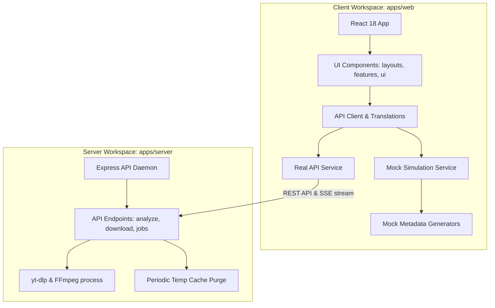

# Architecture Overview

Welcome to the technical architecture documentation for **Bagback Download**. This page describes the monorepo workspace boundaries, structural guidelines, and Clean Architecture topologies.

---

## 1. System Topology & Workspace Breakdown

Bagback Download is organized as a unified monorepo leveraging npm Workspaces:
- **`apps/web` (Vite, React 18, TypeScript)**: Single-page application serving as the download manager client interface. Deploys as standard static assets or offline PWAs.
- **`apps/server` (Node.js, Express, TypeScript)**: Self-contained backend daemon that handles interactions with the underlying download engine (`yt-dlp`) and manages temp file buffers.
- **`packages/core` & `packages/downloader-engine`**: Standalone TypeScript package configurations outlining shared types and schema models.

---

## 2. Clean Architecture & Boundaries

The codebase is split into strict layers to isolate concerns and enforce domain boundaries:
1. **Presentation Layer (`src/components/ui/`, `src/components/layouts/`)**: Isolated visual assets that do not manage application logic or state.
2. **Domain Feature Layer (`src/components/features/`)**: High-level modules implementing specific views, lists, and forms.
3. **Infrastructure Service Layer (`src/lib/api.ts`)**: Interfaces and classes handling network protocols, REST connections, and error handling.
4. **Mock Layer (`src/mocks/`, `src/lib/api.ts`)**: Safe, client-side mocks that decouple the presentation layer from the physical server runtime during showcase environments.
5. **Types Layer (`src/types/`)**: Centralized interfaces shared across all layers.
