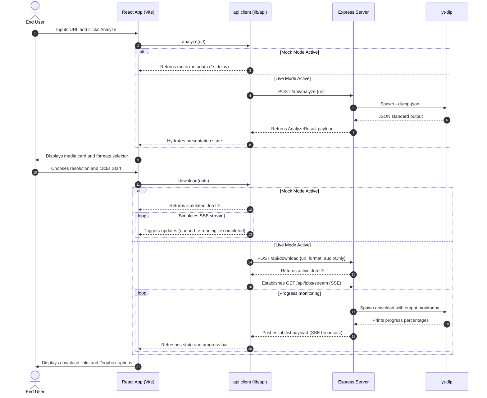

# Data Flow & Sequence

This page outlines the end-to-end data lifecycle of a download session, including analysis metadata parsing, state hydration, error management, and SSE progress updates.

---

## 1. Request Lifecycle Overview

The execution sequence is split depending on whether **Mock Mode** or **Live Mode** is active:

1. **Analyze Stage**:
   - The user inputs a URL.
   - The system validates the URL structure.
   - Metadata (title, duration, channel name, and resolution tables) is extracted.
2. **Download Stage**:
   - The user triggers the download options.
   - A download job is pushed to the queue.
   - Progress increments are monitored dynamically via Server-Sent Events (SSE) or client-side background timer handlers.
   - The physical file is streamed to the user or cached in local storage.

---

## 2. Sequence Diagram

---

## 3. Error Handling Protocol

- **Validation Failures**: Invalid URLs trigger immediate client-side error blocks without touching the backend server or mock generators.
- **Extraction Failures**: If `yt-dlp` fails to parse a link, the Express server falls back to querying a verified proxy pool before returning a `422 Unprocessable Entity` status.
- **Session Failures**: If a download job fails mid-process, it is marked as `failed` with the error description appended to the payload.
