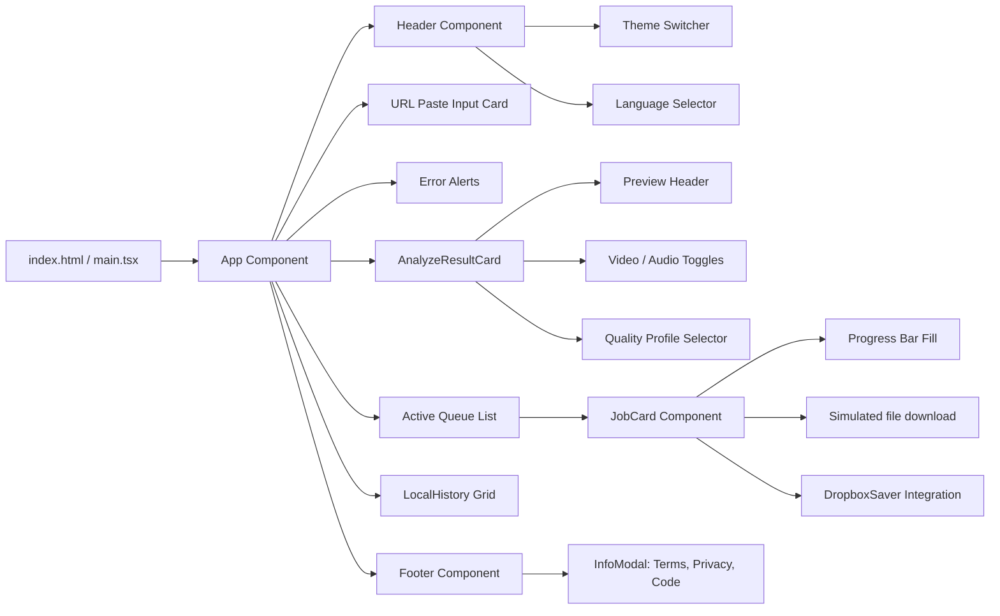

# Component Hierarchy

This page details the UI component architecture, state ownership, and component relationships in the **`apps/web`** application.

---

## 1. UI Component Tree

The web client is built as a modular component hierarchy. The layout is optimized to handle bilingual transitions and strict type-safety:

---

## 2. Component Design Specifications

- **`App` (State Controller)**: Owns global hooks for languages, styling classes, pasted input values, active jobs payload, local storage indices, and modal overlay variables.
- **`Header`**: Holds controls for theme (light/dark class injections) and language selectors (RTL direction mapping).
- **`AnalyzeResultCard`**: Handles selection of audio extractors or specific video resolutions. Uses caching to display thumbnails.
- **`JobCard`**: Monitors download progress. For static showcases, it generates standard in-browser text blobs to allow users to verify the downloader logic offline.
- **`DropboxSaver`**: Connects dynamically to the Dropbox Drop-ins API.
- **`InfoModal`**: Renders dynamic text panels based on the requested policy (Terms of Service, Privacy Policy, or Clean-Room engineering statement).
