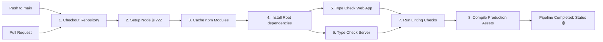

# DevOps & CI/CD Pipeline

This page describes the automated deployment checks, build verifications, and GitHub Action workflows configured for **Bagback Download**.

---

## 1. CI/CD Workflow Pipeline

We use GitHub Actions to run continuous validation on every push or pull request to the `main` branch. This guarantees that all commits conform to our standard of **zero compile-time errors**:

---

## 2. Pipeline Execution Steps

- **Dependency Installation**: Restores workspaces packages using lockfile parameters. Caches node modules across workflow runs to reduce build times.
- **TypeScript Static Verification**:
  - Web client runs type-checks: `npx --workspace=@bagback-download/web tsc --noEmit`
  - Server runs type-checks: `npx --workspace=@bagback-download/server tsc --noEmit`
- **Lint Verification**: Confirms that formatting parameters and code rules match guidelines via `npm run lint`.
- **Production Build Execution**: Spawns compilation scripts across all workspaces:
  - Backend server compiles to Javascript inside `apps/server/dist/`.
  - Frontend web app bundles static assets inside `apps/web/dist/` utilizing Vite's build compiler.
