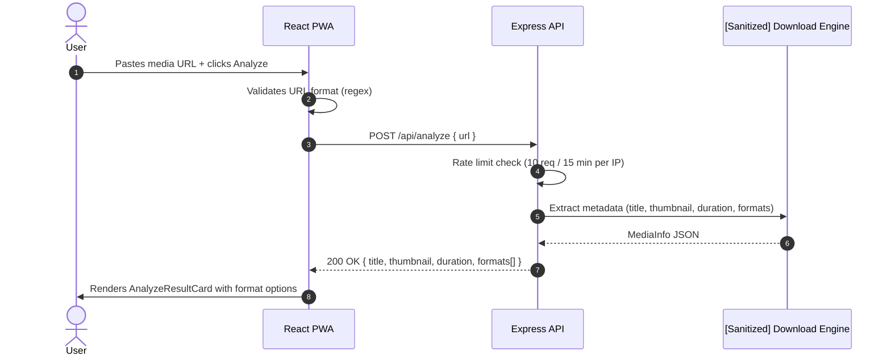
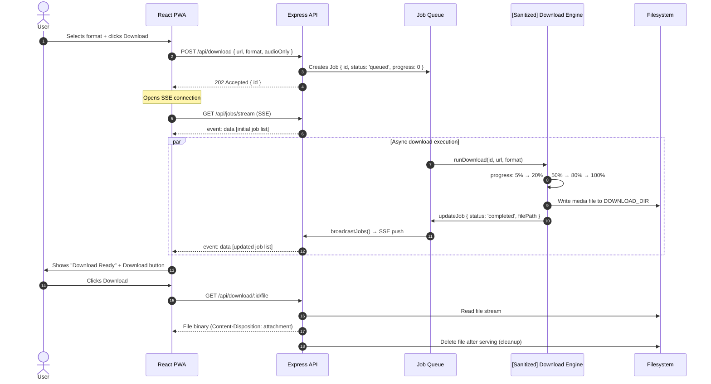
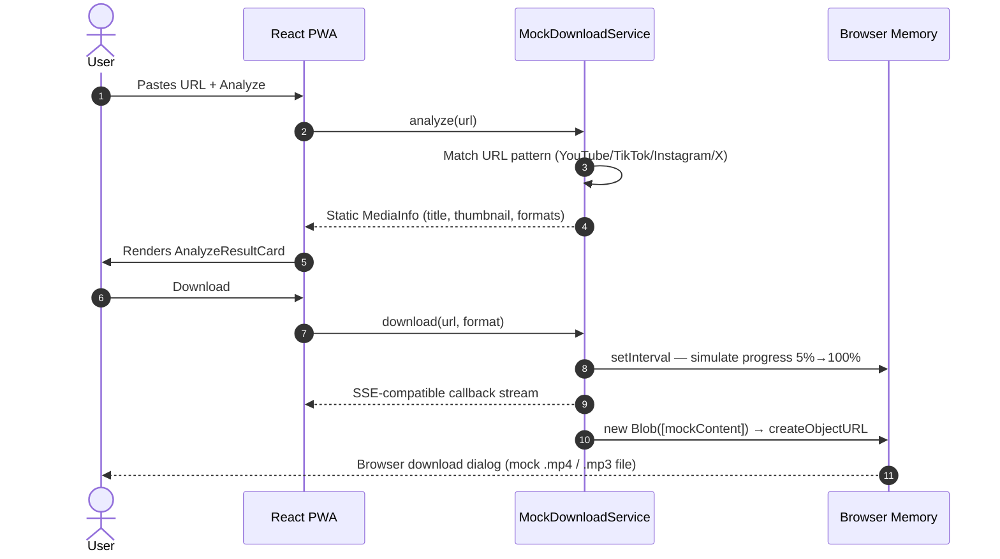

# Data Flow & Sequence Diagrams

This page documents the exact flow of data through the system for the two core user journeys: **URL Analysis** and **File Download**.

---

## 1. URL Analysis Flow



---

## 2. Download Pipeline Flow



---

## 3. Mock Mode Flow (Client-Side)

When `?mock=true` or deployed to static hosting (GitHub Pages, Vercel), the PWA automatically switches to `MockDownloadService`:



---

## 4. SSE Stream Protocol

The API uses Server-Sent Events for job state synchronization:

```
GET /api/jobs/stream
Accept: text/event-stream

← data: [{"id":"abc","status":"queued","progress":0,...}]
← data: [{"id":"abc","status":"running","progress":25,...}]
← data: [{"id":"abc","status":"running","progress":67,...}]
← data: [{"id":"abc","status":"completed","progress":100,...}]
```

**Client handling:**
```typescript
const source = new EventSource('/api/jobs/stream');
source.onmessage = (e) => {
  const jobs: Job[] = JSON.parse(e.data);
  setJobs(jobs);
};
```

**Reconnection:** The browser automatically reconnects on disconnect (EventSource built-in retry). The server re-sends full job state on each new connection.

---

## 5. Auto-Cleanup Job

The server runs a background interval every 60 seconds that evicts completed/failed jobs older than 1 hour and deletes their associated files from disk — ensuring the server never accumulates unbounded state.

```
Every 60s:
  jobs.forEach(job => {
    if (job.status in ['completed', 'failed']) {
      if (age(job) > 1hr) {
        fs.unlink(job.filePath)
        jobs.delete(job.id)
      }
    }
  })
```
