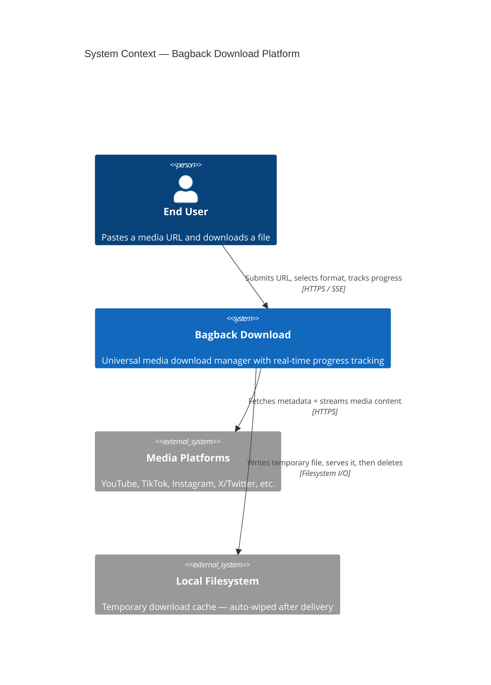
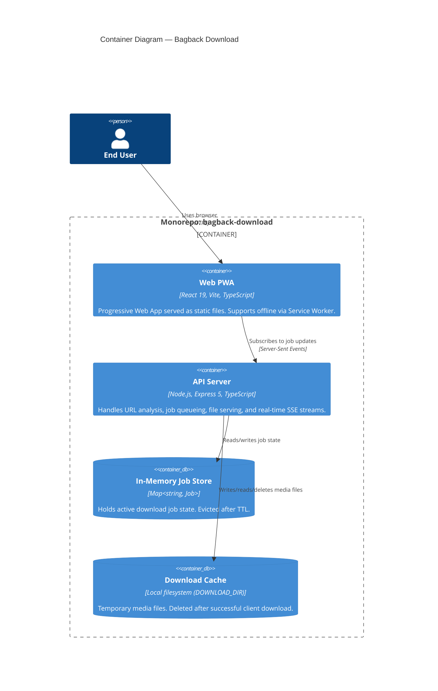

# System Architecture

## C4 Model — Context Level



---

## C4 Model — Container Level



---

## Monorepo Structure

```
bagback-download-showcase/
│
├── apps/
│   ├── web/                         ← Frontend application workspace
│   │   ├── src/
│   │   │   ├── app/App.tsx          ← Root component (state orchestrator)
│   │   │   ├── components/
│   │   │   │   ├── layouts/         ← Header, Footer
│   │   │   │   ├── features/        ← JobCard, AnalyzeResultCard
│   │   │   │   └── ui/              ← Icons, InfoModal, DropboxSaver
│   │   │   ├── lib/
│   │   │   │   ├── api.ts           ← DownloadService interface + Real/Mock impls
│   │   │   │   └── translations.ts  ← EN/AR dictionary + useTranslation hook
│   │   │   ├── mocks/
│   │   │   │   └── handlers.ts      ← Mock metadata generator (by platform)
│   │   │   └── types/
│   │   │       └── index.ts         ← Domain entity types (Job, Lang, etc.)
│   │   ├── public/                  ← Static assets, PWA icons, sitemap
│   │   └── vite.config.ts
│   │
│   └── server/                      ← Backend API workspace
│       └── src/
│           └── index.ts             ← Express routes, SSE, job queue, mocks
│
├── packages/                        ← Shared workspace packages (types, utils)
├── tools/
│   └── showcase-generator.ps1       ← Reusable repo sanitizer script
├── .github/
│   ├── workflows/                   ← CI/CD pipelines
│   ├── ISSUE_TEMPLATE/              ← Bug + Feature YAML forms
│   ├── CODEOWNERS                   ← Code ownership rules
│   └── wiki/                        ← This documentation
├── docker-compose.yml
├── Dockerfile
└── .env.example
```

---

## Technology Decisions

| Decision | Choice | Rationale |
|----------|--------|-----------|
| Frontend framework | React 19 + Vite | Fast HMR, RSC-ready, PWA via `vite-plugin-pwa` |
| Backend framework | Express 5 | Minimal, battle-tested, async-native in v5 |
| Language | TypeScript `strict: true` | Catches 90%+ runtime errors at compile time |
| Real-time protocol | Server-Sent Events (SSE) | Simpler than WebSockets for unidirectional server→client push |
| State management | `useState` + SSE subscription | No Redux overhead needed for this data shape |
| i18n | Custom `useTranslation()` hook | Zero dependency, RTL/LTR via `document.dir` |
| Containerization | Multi-stage Alpine Dockerfile | < 180MB image with Node 22 + Python + FFmpeg |
| Rate limiting | `express-rate-limit` per IP | Cost-free protection without API gateway |
