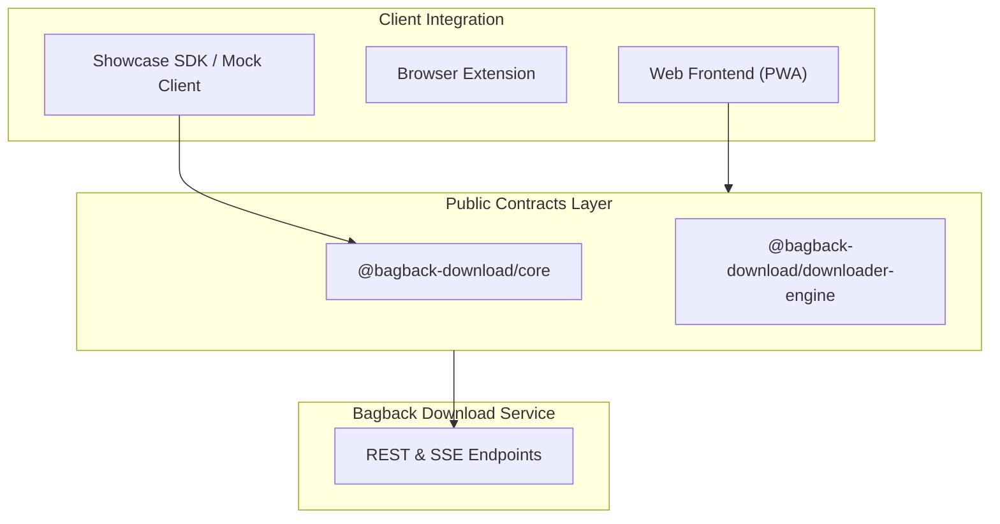

# Bagback Download — Interface Showcase & Public Contracts

  <b>Official Public Architecture, TypeScript Contracts & API Specification for Bagback Download</b> 
  Built by <a href="https://bagbacktech.com">Bagback Digital Solutions</a> & <a href="https://mohamedosama.me">Mohamed Osama</a>

---

## 🌟 Overview

This repository is the public interface and contracts showcase for **Bagback Download**, the universal open-source media download platform.

It exposes the TypeScript definitions, client contracts, architectural designs, and Clean-Room specifications for integrating with the Bagback Download ecosystem.

## 🏗️ Architecture

## 📦 Packages & Contracts

- [`packages/core`](./packages/core): Central TypeScript definitions (`Job`, `JobStatus`, `FormatInfo`, `AppLink`, `UrlAnalysisResult`).
- [`packages/downloader-engine`](./packages/downloader-engine): Modular downloader engine abstraction interfaces.
- [`docs/api-reference.md`](./docs/api-reference.md): Complete REST & SSE API specification.
- [`docs/architecture.md`](./docs/architecture.md): Monorepo and clean-room architectural overview.
- [`examples/mock-client.ts`](./examples/mock-client.ts): Example client contract usage.

## 🚀 Live Product

Experience the full live product at: [https://download.bagbacktech.com](https://download.bagbacktech.com)

## 📄 License

MIT License — Copyright (c) 2026 Mohamed Osama / Bagback Digital Solutions
