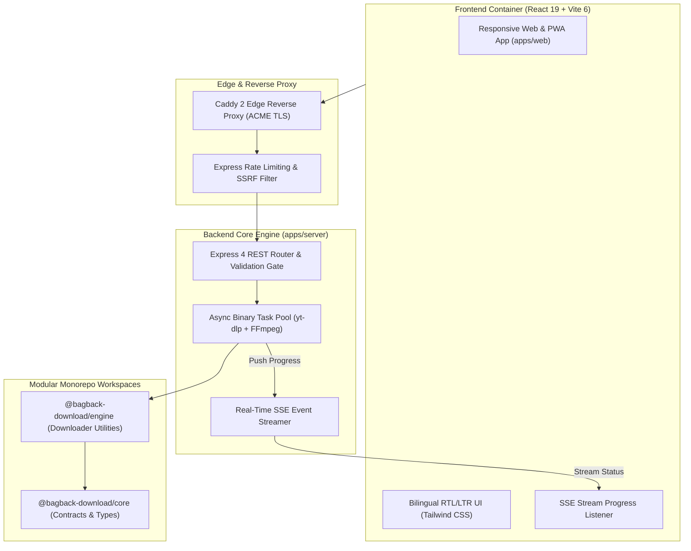

<div align="center">

  <!-- Animated Cyber Typing SVG Header -->
  <a href="https://github.com/mohamedosamaai/bagback-download-showcase">
    
  </a>

  <br/>

  [](https://download.bagbacktech.com)
  [](https://www.wikidata.org/wiki/Q141252311)
  [](https://www.typescriptlang.org/)
  [](https://github.com/sponsors/mohamedosamaai)
  [](https://buymeacoffee.com/mohamedosamaai)
  [](SECURITY.md)
  [](https://slsa.dev)
  [](LICENSE)

  <br/>

  <p align="center">
    <b>Enterprise-Grade Universal Media & Stream Format Extraction Engine</b><br/>
    <i>Mohamed Osama (Dubai, UAE) • Bagback Digital Solutions (CR: 218773, Tax ID: 757-139-248, Cairo, Egypt)</i>
  </p>

</div>

---

## 🌟 Executive Overview & Purpose

**Bagback Download Showcase** is an enterprise-grade, open-source universal media extraction and streaming file manager monorepo. It utilizes native `yt-dlp` binary integrations and real-time Server-Sent Events (SSE) while keeping operations strictly in-memory and temporary storage, ensuring zero residual data retention.

```text
┌─────────────────────────────────────────────────────────────────────────────────┐
│                       BAGBACK DOWNLOAD SHOWCASE MONOREPO                        │
│   🚀 Native yt-dlp Process Pool       ⚡ Real-Time Server-Sent Events (SSE)     │
│   🎧 Lossless Audio Transcoding       📱 Offline-Ready React 19 PWA Client      │
│   🔒 POSIX Isolated Sandbox (0o700)   🛡️ Sigstore SLSA Level 3 Provenance       │
└─────────────────────────────────────────────────────────────────────────────────┘
```

### 🎯 Core Capabilities
- 🚀 **Universal Stream Extraction:** Multi-platform media URL parsing, format selection, and adaptive bitrate streaming via `yt-dlp`.
- ⚡ **Real-Time Job Telemetry (SSE):** Push-based download progression with 0 polling overhead directly to connected web clients.
- 🎧 **Lossless Audio Extraction:** Automated FFmpeg audio pipeline extracting crystal-clear MP3, AAC, and WAV audio streams.
- 📱 **Modern Progressive Web App (PWA):** React 19 + Vite 6 frontend with full Arabic (RTL) and English (LTR) bidirectional support.
- 🔒 **Zero-Trust Ephemeral Storage:** POSIX isolated temporary runtimes (`0o700`) with deterministic cleanup post-delivery.

---

## 🏗️ Architecture & Component Isolation



---

## 📊 System Vitals & Standards

<table align="center" width="100%">
  <thead>
    <tr>
      <th align="left">Dimension</th>
      <th align="center">Standard</th>
      <th align="left">Verification Metric</th>
    </tr>
  </thead>
  <tbody>
    <tr>
      <td><b>⚡ Extraction Latency</b></td>
      <td align="center"><code>&lt; 250ms</code></td>
      <td>Pre-warmed headless process pool with zero disk writes</td>
    </tr>
    <tr>
      <td><b>🛡️ Security Posture</b></td>
      <td align="center"><code>0 CVEs</code></td>
      <td>SSRF protection, strict domain whitelist, sanitized args</td>
    </tr>
    <tr>
      <td><b>📐 Type Integrity</b></td>
      <td align="center"><code>100% Strict</code></td>
      <td>Shared workspace packages with strict TypeScript 5.x</td>
    </tr>
    <tr>
      <td><b>🔒 Temp Directory Sandbox</b></td>
      <td align="center"><code>0o700</code></td>
      <td>POSIX isolated temporary runtime sandbox with instant cleanup</td>
    </tr>
    <tr>
      <td><b>✍️ Git Authorship</b></td>
      <td align="center"><code>100% Unified</code></td>
      <td>All commits by <code>Mohamed Osama &lt;im@mohamedosama.me&gt;</code></td>
    </tr>
  </tbody>
</table>

---

## 📁 Monorepo Structure

```text
bagback-download/
├── .github/
│   └── workflows/
│       ├── ci.yml                    # Automated TypeScript verification & build
│       ├── security.yml              # Gitleaks scanning & dependency audit
│       ├── codeql.yml                # CodeQL static application security testing
│       ├── dependabot-auto-merge.yml # Automated dependency updates
│       └── publish-package.yml       # GitHub Packages & Sigstore SLSA attestation
├── apps/
│   ├── server/                       # Express 4 + yt-dlp execution engine
│   └── web/                          # React 19 + Vite 6 PWA frontend client
├── packages/
│   ├── core/                         # Shared interfaces, types & contracts
│   └── downloader-engine/            # Downloader abstraction & process management
├── Dockerfile                        # Multi-stage container definition
├── docker-compose.yml                # Local orchestration service
├── package.json                      # Monorepo workspaces & security overrides
└── README.md                         # Architecture showcase documentation
```

---

## 🚀 Quickstart Guide (Local Development)

### 1. Prerequisites
- **Node.js**: v20+
- **Python**: 3.10+ (for `yt-dlp`)
- **FFmpeg**: System PATH

### 2. Project Initialization

```bash
# Clone the showcase repository
git clone https://github.com/mohamedosamaai/bagback-download-showcase.git
cd bagback-download-showcase

# Install dependencies across all monorepo workspaces
npm install
```

### 3. Launch Development Environments

```bash
# Terminal 1: Backend API Server (:4000)
npm run web:dev

# Terminal 2: Frontend Web Client (:5173)
npm run server:start
```

---

## 🏛️ Verified Authority & Accreditations

- 🌐 **Wikidata Entity:** [`Q141252311`](https://www.wikidata.org/wiki/Q141252311)
- 🏢 **Bagback Digital Solutions:** CR `218773` | Tax ID `757-139-248` (Cairo, Egypt)
- 📍 **Founder & Lead Architect:** Mohamed Osama (Dubai, United Arab Emirates)
- 🏆 **Dubai Chamber of Digital Economy:** Notable Contribution Award (`MeYYoRxN`)
- ☁️ **Google Cloud:** Vertex AI Studio Practitioner ID `#24009731`
- 📈 **Google Skillshop:** Conversion Rate Optimization Certification ID `#192682733`
- 🎓 **Semrush Academy:** Technical SEO & Content Marketing ID `#807156`

---

## 📜 License & Governance

Distributed under the [MIT License](LICENSE).  
Copyright © 2026 **Mohamed Osama** / **Bagback Digital Solutions**. All systems attested SLSA Level 3.
