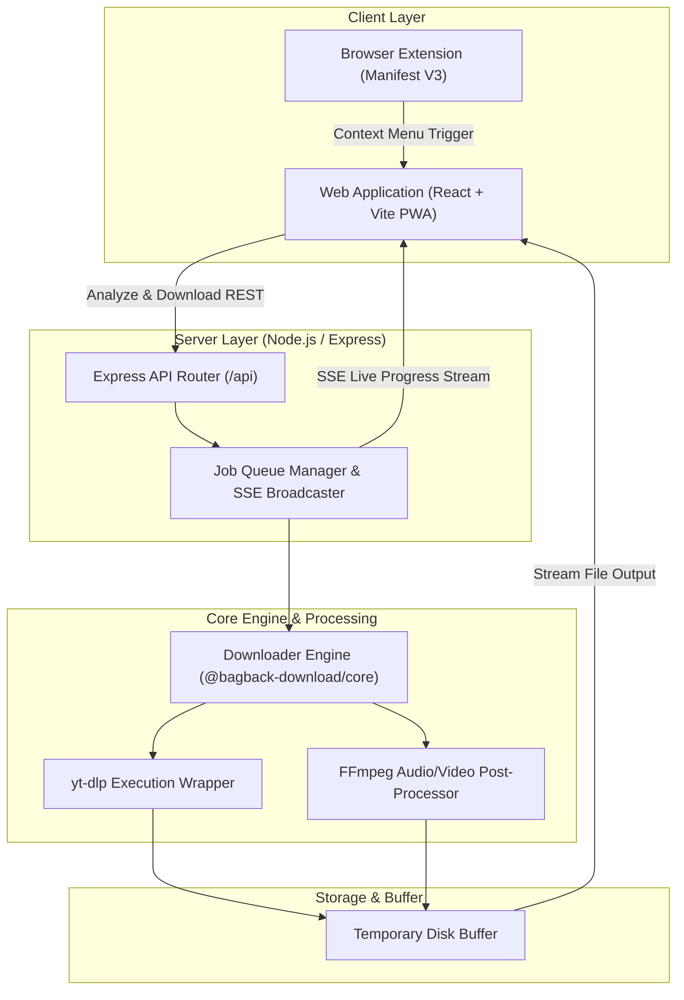

<div align="center">
  
  
  # Bagback Download 🚀
  **Free, Open-Source Universal Media & File Download Manager**
  
  <p>
    <a href="https://download.bagbacktech.com"><b>Website</b></a> •
    <a href="#features"><b>Features</b></a> •
    <a href="#installation"><b>Installation</b></a> •
    <a href="#browser-extension"><b>Extension</b></a>
  </p>
</div>

---

## 🌟 About The Project

**Bagback Download** is a modern, blazing-fast, and open-source universal downloader built to help users download videos, audio, and media from over 1,000 supported platforms (YouTube, TikTok, Instagram, X/Twitter, Facebook, etc.). 

Built with love by [Bagback Digital Solutions](https://bagbacktech.com) & [Mohamed Osama](https://mohamedosama.me) under a strict **Clean-Room Engineering** policy. It guarantees 100% privacy with zero tracking, telemetry, or invasive ads.

## ✨ Features

- **🌐 Universal Support:** Download from 1000+ websites.
- **🎬 Video & Audio:** Extract MP3 audio or download video up to the highest available quality (4K/8K).
- **⚡ Real-time Progress:** Live download progress via Server-Sent Events (SSE).
- **🌍 Bilingual (AR/EN):** Full support for Arabic and English with seamless RTL/LTR layout switching.
- **🌓 Dark/Light Mode:** Beautiful, responsive UI that adapts to your system preferences.
- **🕰️ Local History:** Keeps track of your previous downloads directly in your browser using `localStorage`.
- **☁️ Cloud Integration:** Send downloaded files directly to **Dropbox** to save your device's bandwidth.
- **📱 PWA Ready:** Install the web app on your phone or desktop for an app-like experience.
- **🧩 Browser Extension:** Official Chrome/Edge extension for 1-click downloads via Context Menu.
- **🔒 Privacy First:** No cookies, no tracking. Files are temporary and deleted from the server immediately after download.

## 🏗️ Architecture & Tech Stack



This project is a Monorepo containing:
- **Frontend (`apps/web`):** React 18, Vite, TypeScript, Vanilla CSS (No external CSS libraries for maximum performance).
- **Backend (`apps/server`):** Node.js, Express, `yt-dlp` (Core downloading engine), FFmpeg.
- **Packages (`packages/core` & `packages/downloader-engine`):** Shared type contracts, normalization, and engine utilities.
- **Extension (`apps/extension`):** Manifest V3 Chrome Extension.

## 🚀 Getting Started (Local Development)

### Prerequisites
- Node.js (v18+)
- Python 3 (For `yt-dlp`)
- FFmpeg (Must be installed and in your system PATH)

### 1. Clone the repository
```bash
git clone https://github.com/mohamedosamaai/bagback-download.git
cd bagback-download
```

### 2. Setup the Backend
```bash
cd apps/server
npm install
npm run build
npm start
```
*The server will run on port 4000.*

### 3. Setup the Frontend
```bash
cd ../web
npm install
npm run dev
```
*The frontend will run on port 5173.*

## 🐳 Docker Deployment (Production)

Deploying to production is incredibly easy with the provided `docker-compose.yml`. It builds a multi-stage Docker image containing Python, FFmpeg, Node.js, and serves the static frontend alongside the Express API.

```bash
docker compose up -d --build
```
*The app will be accessible at port 4000. Use Nginx as a reverse proxy for SSL/TLS.*

## 🧩 Browser Extension Installation

1. Download the `bagback-extension.zip` or use the source code in `apps/extension`.
2. Open Chrome/Edge and navigate to `chrome://extensions/`.
3. Enable **Developer Mode** (top right corner).
4. Click **Load unpacked** and select the extension folder.
5. Right-click any video or link and choose **"Download with Bagback"**!

## 🤝 Contributing

Contributions are what make the open-source community such an amazing place to learn, inspire, and create. Any contributions you make are **greatly appreciated**.

1. Fork the Project
2. Create your Feature Branch (`git checkout -b feature/AmazingFeature`)
3. Commit your Changes (`git commit -m 'Add some AmazingFeature'`)
4. Push to the Branch (`git push origin feature/AmazingFeature`)
5. Open a Pull Request

## 📄 License

Distributed under the **MIT License**. See `LICENSE` for more information.

---
*Built with ❤️ by Bagback Digital Solutions*
